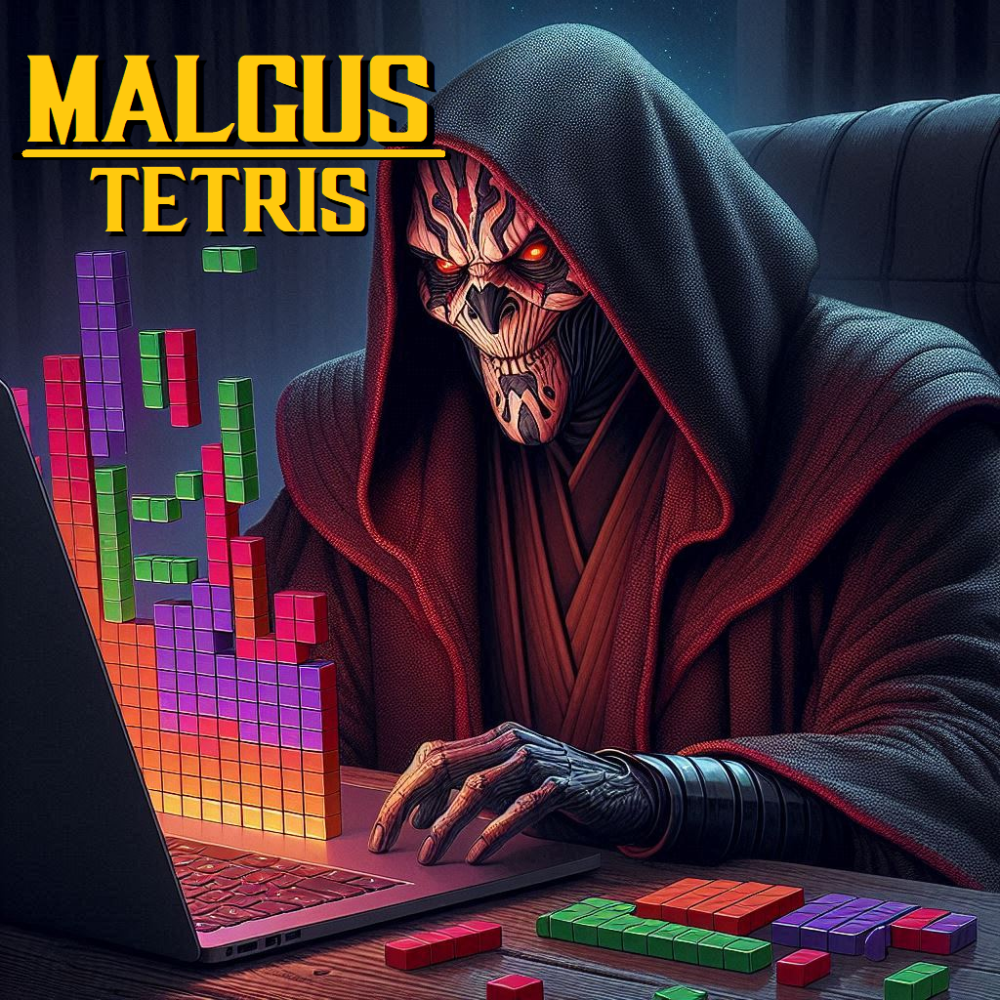

# Malgus Tetris

**Malgus Tetris** is a React-based Tetris game project. This repository contains two main components:

## 1. Dockerized Application

**Standalone Docker Container**: This component allows you to run the game as a self-contained Docker container. The Docker setup ensures that the game can be easily deployed and tested in any environment.

## 2. Public GitHub Pages Site

**Publicly Available Website**: The game is also hosted as a public website through GitHub Pages. This provides a live, accessible version of Malgus Tetris that can be viewed and played directly from a web browser.

For detailed setup instructions and usage, please refer to the accompanying documentation files.

